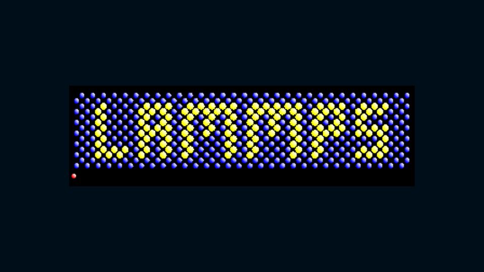
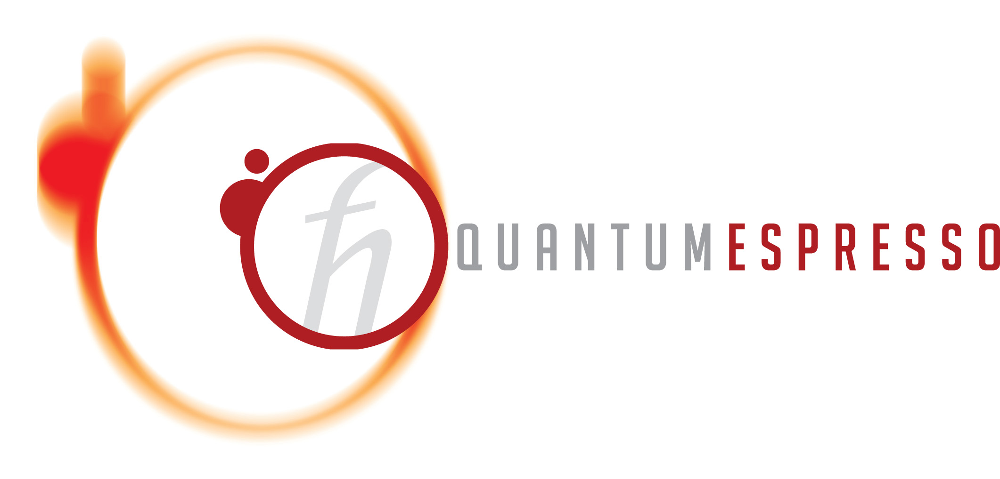

    <h1 style="color: #ffffff; 
               font-family: 'Helvetica Neue', Arial, sans-serif; 
               font-weight: 800; 
               letter-spacing: 1px; 
               margin: 0 0 10px 0; 
               font-size: 2.8rem;">
        🔬 Multi-Scale Computational Mechanics Portfolio
    </h1>
    

        Molecular Dynamics and Finite Element Analysis mini projects
    

    
    
    

    <h2 style="color: #ffffff; font-family: 'Helvetica Neue', Arial, sans-serif; margin: 0; font-size: 1.8rem; font-weight: 700;">🔬 Core Computational Research Frameworks</h2>

<ul style="list-style-type: none; padding-left: 0; font-family: 'Helvetica Neue', Arial, sans-serif; margin: 0;">
    <li style="background-color: #f8f9fa; border-left: 5px solid #2980b9; padding: 18px; border-radius: 4px; margin-bottom: 15px; box-shadow: 0 2px 4px rgba(0,0,0,0.02);">
        

            <strong style="color: #2c3e50; font-size: 1.15rem;">📦 Interatomic Energy Mapping: Lennard-Jones Potential Evaluation</strong>
            Lattice Stability
        

        
Systematic structural screening and parameter testing of empirical Lennard-Jones potential frameworks mapped across localized FCC (Aluminum) and BCC (Iron) crystal matrices to evaluate stability boundaries.

    </li>
    <li style="background-color: #f8f9fa; border-left: 5px solid #e74c3c; padding: 18px; border-radius: 4px; margin-bottom: 15px; box-shadow: 0 2px 4px rgba(0,0,0,0.02);">
        

            <strong style="color: #2c3e50; font-size: 1.15rem;">🔥 Phase Transformation Dynamics: Copper Melting Point Analysis</strong>
            Thermodynamics
        

        
Implementation of sequential thermodynamic ensembles (NPT, NVT, and NVE) under classical Molecular Dynamics frameworks to capture localized density trends, coordinate instabilities, and determine phase transition metrics.

    </li>
    <li style="background-color: #f8f9fa; border-left: 5px solid #27ae60; padding: 18px; border-radius: 4px; margin-bottom: 15px; box-shadow: 0 2px 4px rgba(0,0,0,0.02);">
        

            <strong style="color: #2c3e50; font-size: 1.15rem;">📈 Equation of State Bounds: Energy-Volume & Stress-Strain Topology</strong>
            Optimization Matrix
        

        
Derivation of cohesive crystalline structural configurations via automated isotropic cell dilation mapping. Connects structural ground-state energy minimization curves directly to observable mechanical constitutive profiles.

    </li>
    <li style="background-color: #f8f9fa; border-left: 5px solid #8e44ad; padding: 18px; border-radius: 4px; margin-bottom: 5px; box-shadow: 0 2px 4px rgba(0,0,0,0.02);">
        

            <strong style="color: #2c3e50; font-size: 1.15rem;">⚙️ Multiphysics Mechanics: Tensile Deformation & Heat Transfer Coupling</strong>
            FEA / Continuum
        

        
Finite Element Analysis (FEA) tracking thermomechanical strain energy responses, localized displacement fields, boundary flux gradients, and stress distribution pathways under physical loading criteria.

    </li>
</ul>

